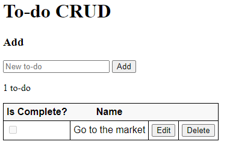
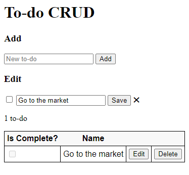

# To-Do List

API desenvolvida utilizando o tutorial Aplicativos API Web da Microsoft, disponível em: https://docs.microsoft.com/pt-br/aspnet/core/tutorials/first-web-api?view=aspnetcore-5.0&tabs=visual-studio-code

&nbsp;

| API                       | Descrição                                 | Corpo da Solicitação      | Corpo da resposta                    |
| ------------------------- | ----------------------------------------- | ------------------------- | ------------------------------------ |
| GET /api/TodoItems        | Obter todos os itens de tarefas pendentes | Nenhum                    | Matriz de itens de tarefas pendentes |
| GET /api/TodoItems{id}    | Obter um item por ID                      | Nenhum                    | Item de tarefas pendentes            |
| POST /api/TodoItems       | Adicionar um novo item                    | Item de tarefas pendentes | Item de tarefas pendentes            |
| PUT /api/TodoItems{id}    | Atualizar um item existente               | Item de tarefas pendentes | Nenhum                               |
| DELETE /api/TodoItems{id} | Excluir um item                           | Nenhum                    | Nenhum                               |

&nbsp;

## Design do aplicativo

&nbsp;
&nbsp;

## Etapa 1  - Criar uma API Web

### Aprendizados

* Criar um projeto de API Web.
* Adicionar uma classe de modelo e um contexto de banco de dados.
* Fazer scaffold de um controlador com métodos CRUD.
* Configurar o roteamento, os caminhos de URL e os valores retornados.
* Chamar a API Web com o Postman.

### Pacotes Utilizados

* Microsoft.EntityFrameworkCore.InMemory
* Microsoft.VisualStudio.Web.CodeGeneration.Design
* Microsoft.EntityFrameworkCore.Design
* Microsoft.EntityFrameworkCore.SqlServer

&nbsp;
&nbsp;

## Etapa 2 - Chamar a API com JavaScript

* Adição de uma página HTML (Interface de Usuário) com formulários para criar e gerenciais itens da To-do list.
* Adição de manipuladores de eventos aos elementos que resultam em solicitações HTTP para os métodos de ação da API Web.

<figure>

</figure>

<figure>

</figure>

